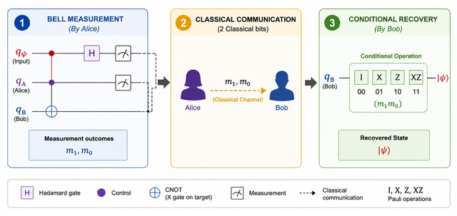
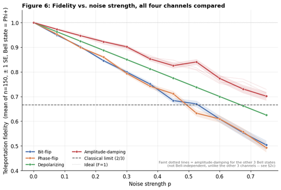
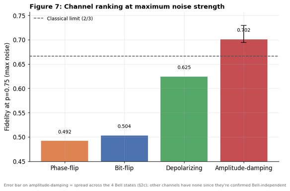
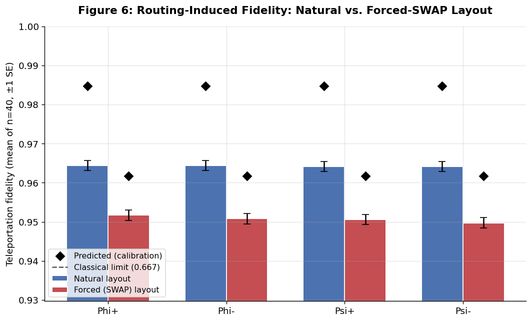
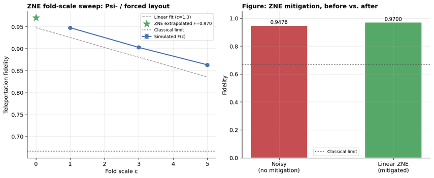

# Robustness of Quantum Teleportation under Bell-Entangled Channels

**Noise & Routing-Overhead Study with Error Mitigation via Linear ZNE**

Quantum Internship, Summer 2026 — School of Natural Sciences (SNS), NUST
Group 5: Fatima Aftab · Laraib Bibi · Sara Masood · Muhammad Shahan
Supervisor: Prof. Dr. Shahid Iqbal | Mentors: Ali, Tooba, Osaid

---

## Abstract

Teleportation is a core primitive for quantum networks, but fidelity degrades on NISQ hardware via noise channels and compiler-inserted SWAP routing, with unclear relative impact. We simulate four noise channels and natural vs. forced-SWAP qubit layouts on real IBM calibration data (`FakeSherbrooke`), then apply Linear Zero-Noise Extrapolation (ZNE) to mitigate the worst case. Bit-flip and phase-flip prove most damaging on average; forced routing causes a significant **1.40% fidelity drop** (vs. a **2.33% calibration-only prediction**), revealing that real circuit errors partially cancel rather than compound worst-case. ZNE recovers **~2.2 percentage points** of fidelity, showing that software-level mitigation can offset hardware-level routing cost — a practical path toward NISQ-viable quantum communication.



---

## Key Results

| Stage | Finding |
|---|---|
| **1 — Ideal baseline** | All four Bell states reconstruct the input state with F ≈ 1 (to ~10⁻¹³), confirming correct circuit logic before any noise is added. |
| **2 — Noise channel sweep** | Bit-flip and phase-flip are the *most* damaging channels on average (not depolarizing/amplitude-damping, as originally hypothesized), because they push every state along a single fixed axis. Amplitude-damping is the only channel with a genuine Bell-state-dependent spread (~4% at p = 0.75) once modeled correctly on the entangled pair. |
| **3 — Routing overhead** | A SWAP-forced qubit layout drops fidelity by **1.40%** relative to a SWAP-free natural layout (z ≈ 14.8, highly significant) — smaller than the 2.33% predicted by a calibration-only worst-case bound, since real gate errors partially cancel rather than compound. |
| **4 — ZNE mitigation** | Linear Zero-Noise Extrapolation on the worst case (Ψ⁻, forced layout) recovers fidelity from **0.9476 → 0.9700** (~2.2 percentage points), confirmed against a quadratic Lagrange fit (0.9719, <0.2% deviation). |

### Fidelity vs. noise strength, all four channels


### Channel ranking at maximum noise (p = 0.75)


### Routing overhead: natural vs. forced-SWAP layout


### ZNE fold-scale sweep and mitigation result


---

## Methodology

- **Stage 1 (Ideal baseline):** Full 3-qubit teleportation circuits for all four Bell states, simulated via exact density-matrix evolution (no shot noise), including real mid-circuit measurement and classically-controlled correction gates.
- **Stage 2 (Noise-channel sweep, p ∈ [0, 0.75]):** Bit-flip, phase-flip, depolarizing, and amplitude-damping channels, modeled via Kraus operators. Fidelity averaged over n = 150 Haar-random input states per (channel, p), triple cross-checked between a full Qiskit gate-level simulation, a hand-derived closed-form formula, and an independent QuTiP simulation (agreement to <10⁻⁶).
- **Stage 3 (Routing-induced noise):** Natural layout (2 two-qubit gates, no SWAP) vs. forced layout (SWAP implemented as 3 CNOTs → 5 two-qubit gates total), transpiled onto `FakeSherbrooke` — a real, locally-bundled 127-qubit IBM calibration snapshot. n = 40 random input states × 4 Bell states × 2 layouts, 2048 shots per circuit.
- **Stage 4 (Linear ZNE):** Unitary gate folding `U → U(U†U)^k` at fold scales 1×, 3×, 5× on the worst Stage-3 case, extrapolated to the zero-noise limit via the Richardson two-point formula, with a quadratic Lagrange fit as a sanity check.

Full mathematical derivations for all four stages are in [`docs/theory_derivations.pdf`](docs/theory_derivations.pdf).

---

## Repository structure

```
.
├── notebooks/
│   ├── notebook_1_ideal_and_noise_models.ipynb    # Stages 1 & 2
│   └── notebook_2_swap_vs_natural_zne.ipynb       # Stages 3 & 4
├── docs/
│   ├── poster.pdf                 # Final presentation poster
│   ├── theory_derivations.pdf     # Full hand-derived mathematics, Stages 1–4
│   └── results_writeup.docx       # Detailed narrative results & analysis
├── figures/                       # Key result figures (exported from the poster)
├── results/                       # (add exported CSVs / data tables here)
├── requirements.txt
├── LICENSE
└── README.md
```

## How to run

```bash
git clone <this-repo-url>
cd quantum-teleportation-zne-robustness
python -m venv venv && source venv/bin/activate   # or venv\Scripts\activate on Windows
pip install -r requirements.txt
jupyter notebook notebooks/notebook_1_ideal_and_noise_models.ipynb
```

Both notebooks were run cell-by-cell start to finish; all self-checks pass (ideal baseline F = 1.0 to 13 decimal places, closed-form/QuTiP/Qiskit agreement to <10⁻⁶, gate-count and ZNE fold-scale values matching the hand derivations in `docs/theory_derivations.pdf`).

## References

1. Oh, S., Lee, S., & Lee, H. (2002). Fidelity of quantum teleportation through noisy channels. *Phys. Rev. A*, 66, 022316.
2. Usher, N., & Browne, D. E. (2017). Noise in one-dimensional measurement-based quantum computing. *Quantum Inf. Comput.*, 17, 1372–1397. [arXiv:1704.07298](https://arxiv.org/abs/1704.07298)
3. Hillmich, S., Zulehner, A., & Wille, R. (2021). Exploiting quantum teleportation in quantum circuit mapping. *Proc. ASP-DAC '21*, 792–797. [arXiv:2011.07314](https://arxiv.org/abs/2011.07314)
4. Sohn, H., et al. (2025). Application of zero-noise-extrapolation-based quantum error mitigation to a silicon spin qubit. *Phys. Rev. A*, 112, 012408.
5. Nielsen, M. A. (2002). A simple formula for the average gate fidelity of a quantum dynamical operation. *Physics Letters A*, 303(4), 249–252.
6. Rindell, T., Yenilen, B., Halonen, N., Pönni, A., Tittonen, I., & Raasakka, M. (2023). Exploring the optimality of approximate state preparation quantum circuits. *Physics Letters A*, 475, 128860. [arXiv:2210.06411](https://arxiv.org/abs/2210.06411)

## Contact

Fatima Aftab — faftab.bsphy24sns@student.nust.edu.pk
